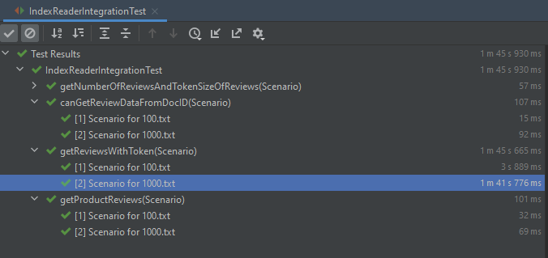

# Tests for IR course

The tests use JUnit 5(and some other JUnit related libraries) and GSON(JSON library)

This repository uses the maven build tool, defining the dependencies in `pom.xml`. You must use
Maven if you wish to use these tests, other ways of importing libraries(e.g adding jars) aren't supported.


## Instructions

1. Make sure you have an up-to-date [Maven](https://maven.apache.org/download.cgi)
  (a Java build system) and Java 11+
  
   The maven executable(`mvn`) should be on your PATH. I believe IntelliJ IDEA has its
   own maven executable which can also be used, within Maven projects, by double tapping the Ctrl 
   key and typing "mvn", without having maven on your PATH.
  

2. Clone this repository
  
3. Copy your project files into the newly cloned folder, such that all your .java files(and
   other packages/folders) are under `src/main/java/webdata`
   
   The folder hierarchy should look like this:


   ```
   projRoot/pom.xml
   projRoot/src/main/java/webdata/SlowIndexWriter.java
   projRoot/src/main/java/webdata/IndexReader.java
   projRoot/src/main/java/webdata/ ... other .java files and folders ...
   projRoot/src/test/java/webdata/IndexReaderIntegrationTest.java
   projRoot/datasets/100.txt
   projRoot/datasets/100.json
   projRoot/datasets/1000.txt
   projRoot/datasets/1000.json
   ```

   where `projRoot` is the root folder of the repository


4. Run `mvn test` to download all dependencies(testing framework) and run all the tests.

5. [Optional]

   If using an IDE, load the root folder as a Maven project. [See this for IntelliJ instructions](https://www.jetbrains.com/help/idea/maven-support.html#maven_import_project_start)
   You should now be able to open the `IndexReaderIntegrationTest.java` file and run 
   specific tests by clicking the green arrows next to the line numbers, or run with a debugger/profiler, etc...
   

## Expected running time

I've got the following running time on an i5-7300HQ CPU:

 


(Index construction, not measured here, shouldn't take more than a few seconds)


## Regarding issues

If you have technical issues running the tests or think there's a problem with their correctness, please create a Github issue.

Regarding tokenization, I used the `[^A-Za-z0-9]++` regex pattern to determine what is not a number/letter,
and don't consider an empty string as a token. 